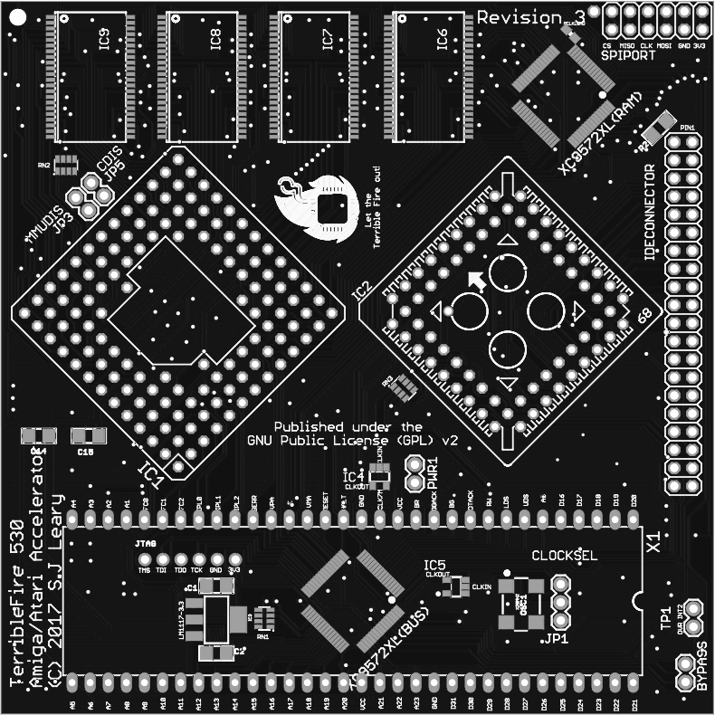
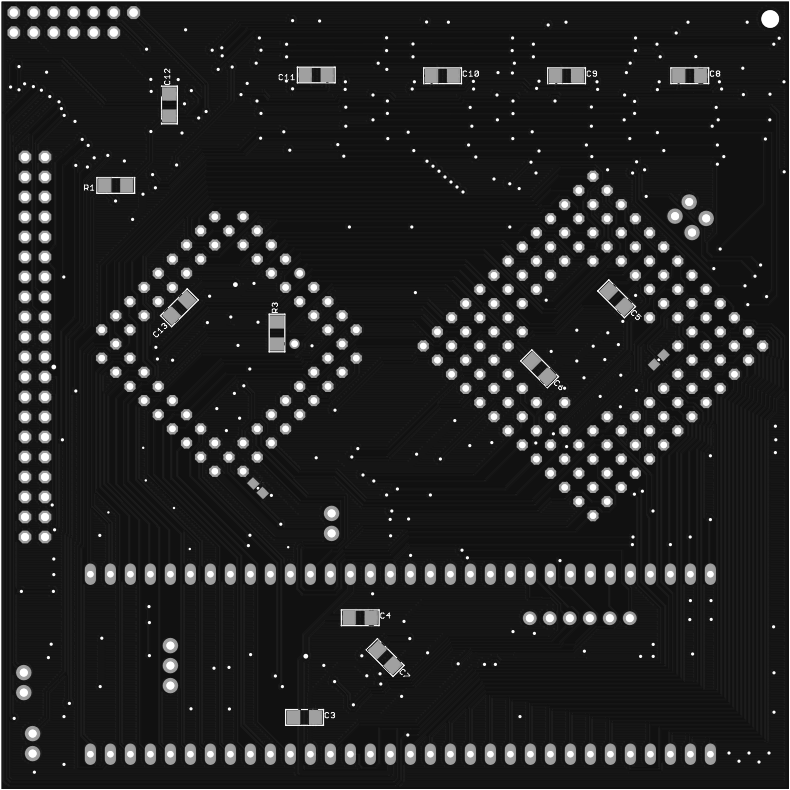

# TF530 Revision 3

WARNING: This board has not been CE tested. It may cause damage to your A500. I take no responsibility for this. 

This repository contains all the files needed to produce a copy of my accelerator board.

The CPLD Required is a XC9572XL-10VQ64.  The CPLD XC9572XL-10VQG64 is the readily available RoHS "Green" lead-free equivalent.

Everything in this repository is released under the GNU GPLv2. You may create or base commercial PCBs from the work in this repository but you must make the sources for all derivative work available. I have noticed some forks have removed copyright notices. This is a breach of the GPL.

## Firmware / Requirements

  * Xilinx ISE, 14.7 (the final version - other versions may work but this is the one I support)
  * JTAG Adaptor

[For more information visit my channel](https://www.youtube.com/c/TerribleFire)

## License

This project and all the files contained are released under the GNU GPLv2. If you build a modified version of the board you must supply the end user with all the sources (this can be a web link).

## The TerribleFire 530 board (Revision 3)

Completely untested board link.... use with caution!!!! Do not come crying to me if it didnt work!!

http://dirtypcbs.com/store/designer/details/12476/2654/tf530-rev3-zip

## The TerribleFire 530 board (Revision 2)

This board is now in Beta. It may not work in all circumstances but it has been verified to boot AmigaOS 1.3, 2.05 and 3.1 and run various games and desktop apps at 25Mhz. Operation is not guarunteed to be crash free but will work in most "happy path" situations.

I have only verified the HD interface with Compact Flash cards.
I have verified this board boots on Amiga 500 Rev 5, 6a, 8.1a

I accept no responsibiltiy for any damage to any equipment that results from the use of this board. IT IS ENTIRELY AT YOUR OWN RISK!

## Installation

As of Revision 3 installation no longer needs the OVR and INT2 signals connected to the Amiga motherboard. The headers remain on the TF530 for testing but do not need to be connected although it should make little difference if they are connected. Well behaved Autoconfig devices will work alongside the TF530. The autoconfig space asserts the internal OVR signal when there are PICs remaining to be configured. After which the autoconfig will probe the standard bus. This revision should work on the A2000 (untested).

IPL0 has not been routed because we only ever need to assert INT2 and/or INT6.

## What does the board look like

The TF530 Rev 3 looks like...

## The Rev 3 BOM (WARNING! This is untested)

| Qty | Value           | Device             | Package              | Parts                                                            | Description                   |
|-----|-----------------|--------------------|----------------------|------------------------------------------------------------------|-------------------------------|
| 1   |                 | MC68030RC          | MPGA128              | IC1                                                              | 68030 PROCESSOR               |
| 1   |                 | MC68882FN          | PLCC68-S             | IC2                                                              | 68882 CO-PROCESSOR (FPU) + PLCC68 Thru Hole Socket |
| 2   | 0.1uF           | 0.1UF-25V(+80/-20%)| 0603-CAP             | C16, C17                                                         | CAP-00810                     |
| 15  | 10uF            | CAP_CERAMIC1206    | 1206                 | C1, C2, C3, C4, C5, C6, C7, C8, C9, C10, C11, C12, C13, C14, C15 | Ceramic Capacitors            |
| 3   | 1K              | RESISTOR1206       | 1206                 | R1, R2, R3                                                                  | Resistors                     |
| 2   | 74LVC1G17DBV    | 74LVC1G17DBV       | SOT23-5              | IC4, IC5                                                         | Single Schmitt-Trigger Buffer |
| 4   | AS7C4096A-12TCN | AS7C4096A-12TCN    | TSOP44-II            | IC6, IC7, IC8, IC9                                               | SRAM 512k x 8, 5V DO NOT USE ISSI Chips!!      |
| 1   | BYPASS          | JUMPER-2PTH        | 1X02                 | BYPASS                                                           | Jumper                        |
| 3   | CAY16-102J4LF   | CAY16-102J4LF      | RESCAXE80P320X160-8N | RN1, RN2, RN3                                                    | Res Thick Film Array 1K Ohm  |
| 1   | CDIS            | JUMPER-2PTH        | 1X02                 | JP5                                                              | Jumper                        |
| 1   | CLOCKSEL        | JUMPER-3PTH        | 1X03                 | JP1                                                              | Jumper                        |
| 1   | EXT5V           | JUMPER-2PTH        | 1X02                 | PWR1                                                             | Jumper                        |
| 1   | IDE CONNECTOR   | PINHD-2X20         | 2X20                 | IDECONNECTOR                                                     | PIN HEADER                    |
| 1   | INF             | 0.05OHM-1/5W-1%    | 0603                 | RCLKLOAD                                                         | Not Required - Experimental   |
| 1   | JTAG            | HEADER-1X6ROUND    | 1X06_ROUND           | JTAG                                                             | PIN HEADER                    |
| 1   | LM1117-3.3      | V_REG_LM1117SOT223 | SOT223               | IC3                                                              | 3.3V Voltage Regulator LM1117 |
| 1   | MC68000         | MC68000P           | DIL64                | X1                                                               | 68xxx CPU Slot Strip Headers  |
| 1   | MMUDIS          | JUMPER-2PTH        | 1X02                 | JP3                                                              | Jumper                        |
| 1   | SPI PORT        | PINHD-2X6          | 2X06                 | SPIPORT                                                          | PIN HEADER                    |
| 1   | TP1             | JUMPER-2PTH        | 1X02                 | TP1                                                              | Jumper                        |
| 1   | X25MHZ          | OSCILLATOR         | OSC_7X5MM            | OSC1                                                             | Oscillator e.g. 25MHz         |
| 2   | XC9572XL-VQ64   | XC9572XL-VQ64      | VQ64                 | XC9572XL(BUS), XC9572XL(RAM)                                     | Xilinx CPLD                   |

### Notes

* _The CPU and (optional) FPU must be 25MHz/33Mhz capable._
